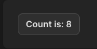
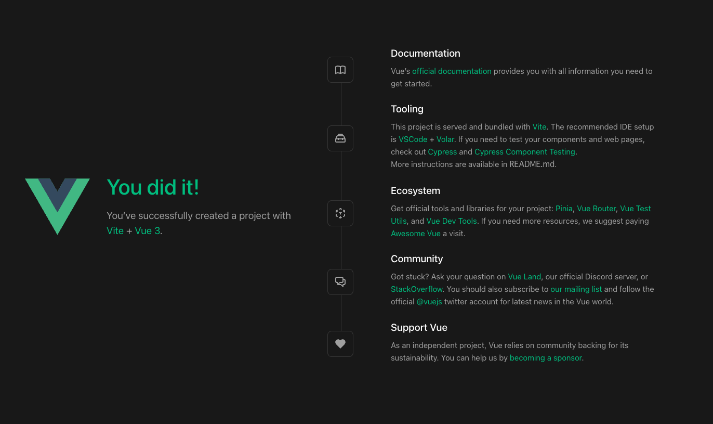

[vue tutorial guide](https://ja.vuejs.org/guide/introduction.html)を淡々とこなしていく

# [introduction](https://ja.vuejs.org/guide/introduction.html)

Vueはユーザインタフェース構築のためのJavaScript Framework

コンポーネントベースの宣言的プログラミングモデルを提供する

最小限サンプルは以下の通り

```javascript
import { createApp } from 'vue'

createApp({
  data() {
    return {
      count: 0
    }
  }
}).mount('#app')
```

```html
<div id="app">
  <button @click="count++">
    Count is: {{ count }}
  </button>
</div>
```



- Declarative rendering: Vueでは標準的なHTMLを拡張したテンプレート構文を使って、HTMLの出力を宣言的に記述することができる
- Reactivity: VueはJavaScriptの状態の変化を自動的に追跡し、変化が起きると効率的にDOMを更新する

Progressive Framework

- ビルドステップなしで静的な HTML を拡充する
- 任意のページに Web コンポーネントとして埋め込む
- シングルページアプリケーション (SPA)
- フルスタック / サーバーサイドレンダリング (SSR)
- Jamstack / 静的サイトジェネレーション (SSG)
- デスクトップ、モバイル、WebGL、さらにはターミナルをターゲットとする開発

Single File Component

単一ファイルコンポーネントと呼ばれる、HTMLに似たファイル形式のVueコンポーネントがよく利用される (.vue ファイルとしても知られ、「SFC」と略される）

```javascript
<script>
export default {
  data() {
    return {
      count: 0
    }
  }
}
</script>

<template>
  <button @click="count++">Count is: {{ count }}</button>
</template>

<style scoped>
button {
  font-weight: bold;
}
</style>
```

Vue コンポーネントを作成する際は、Options API、そして Composition API と呼ばれる 2 種類の異なる API スタイルが利用できます。

- Options API: data,methods,mountedといった数々のオプションからなる1つのオブジェクトを用いてコンポーネントのロジックを定義する。thisでアクセスできる
- Composition API: importした各種API関数を使ってコンポーネントのロジックを定義する

## Options API

```
Options API の考え方は、「コンポーネントのインスタンス」(サンプルに見られる this) を中心とするもので、OOP (Object Oriented Programming: オブジェクト指向プログラミング) 言語の経験のあるユーザーにとってはクラスベースの心理的モデルによく適合します。同時に、Options API ではリアクティビティーの細かな部分が抽象化され、各オプションのグループによってコードの構成が整理されるため、初心者にとって分かりやすいモデルでもあります。
```

```javascript
<script>
export default {
  // data() で返すプロパティはリアクティブな状態になり、
  // `this` 経由でアクセスすることができます。
  data() {
    return {
      count: 0
    }
  },

  // メソッドの中身は、状態を変化させ、更新をトリガーさせる関数です。
  // 各メソッドは、テンプレート内のイベントリスナーにバインドすることができます。
  methods: {
    increment() {
      this.count++
    }
  },

  // ライフサイクルフックは、コンポーネントのライフサイクルの
  // 特定のステージで呼び出されます。
  // 以下の関数は、コンポーネントが「マウント」されたときに呼び出されます。
  mounted() {
    console.log(`The initial count is ${this.count}.`)
  }
}
</script>

<template>
  <button @click="increment">Count is: {{ count }}</button>
</template>
```

## Composition API

```
Composition API は、リアクティブな状態変数を関数のスコープ内で直接宣言し、複数の関数の組み合わせによって状態を組み立てて複雑な処理を扱おう、という考え方が中心にあります。より自由度が高い形式であるため、効果的な使い方をするには Vue のリアクティビティーがどのような仕組みで動くのかを理解しておく必要があります。その代わり、柔軟性が高いことから、さまざまなパターンに沿ってロジックの整理や再利用を強力に進めることができます。
```

```javascript
<script setup>
import { ref, onMounted } from 'vue'

// リアクティブな状態
const count = ref(0)

// 状態を変更し、更新をトリガーする関数。
function increment() {
  count.value++
}

// ライフサイクルフック
onMounted(() => {
  console.log(`The initial count is ${count.value}.`)
})
</script>

<template>
  <button @click="increment">Count is: {{ count }}</button>
</template>
```

## Application settings

アプリケーションのインスタンスは`.config`オブジェクトを公開し、いくつかのアプリケーションレベルのオプションを設定できる

例えば、すべての子孫コンポーネントから発生したエラーを補足するアプリケーションレベルのエラーハンドラーを定義するコードは以下の通り

```javascript
app.config.errorHandler = (err) => {
  /* エラーの制御 */
}
```

アプリケーションのインスタンスは、アプリ用のアセットを登録するいくつかのメソッドもいくつか用意している

コンポーネントの登録するメソッドは以下の通り

```javascript
app.component('TodoDeleteButton', TodoDeleteButton)
```

このメソッドは `TodoDeleteButton` をこのアプリケーション内でならどこでも使用できるようにする

# quick start

https://ja.vuejs.org/guide/quick-start.html をやる

## project initialization

```bash
$ npm init vue@latest
Need to install the following packages:
  create-vue@3.6.1
Ok to proceed? (y) y

Vue.js - The Progressive JavaScript Framework

✔ Project name: … vue-tutorial
✔ Add TypeScript? … No / Yes
✔ Add JSX Support? … No / Yes
✔ Add Vue Router for Single Page Application development? … No / Yes
✔ Add Pinia for state management? … No / Yes
✔ Add Vitest for Unit Testing? … No / Yes
✔ Add an End-to-End Testing Solution? › No
✔ Add ESLint for code quality? … No / Yes

Scaffolding project in /Users/okmt/plays/vue/vue_tutorial/vue-tutorial...

Done. Now run:

  cd vue-tutorial
  npm install
  npm run dev
```

## starting

```bash
$ npm run dev
  VITE v4.3.4  ready in 250 ms

  ➜  Local:   http://localhost:5173/
  ➜  Network: use --host to expose
  ➜  press h to show help
```



## CDN for vue

```
<script src="https://unpkg.com/vue@3/dist/vue.global.js"></script>
```

## divide file

index.htmlを以下のように定義する

```html
<!-- index.html -->
<div id="app"></div>

<script type="module">
  import { createApp } from 'vue'
  import MyComponent from './my-component.js'

  createApp(MyComponent).mount('#app')
</script>
```

my-component.jsは以下の通り

```javascript
export default {
  data() {
    return { count: 0 }
  },
  template: `<div>count is {{ count }}</div>`
}
```

# Creating Vue Application

## application instance

createApp 関数で新しいアプリケーションインスタンスを作成する

```javascript
import { createApp } from 'vue'

const app = createApp({
  /* ルートコンポーネント オプション */
})
```

## route component

createAppで作成したコンポーネントはルートコンポーネントと呼び、他のコンポーネントを小要素として保持している

```javascript
import { createApp } from 'vue'
import App from './App.vue'

const app = createApp(App)
```

## Application mount

Applicationのinstanceは、`.mount()` メソッドが呼ばれるまで何もレンダリングしない

instanceには「コンテナ」引数という実際のDOM要素とセレクター文字列が必要

```html
<div id="app"></div>
```

```javascript
app.mount('#app')
```

## Route component template in DOM

通常、ルートコンポーネントのテンプレートはコンポーネント自体の一部ですが、マウントコンテナー内に直接記述することで、テンプレートを別途提供することもできる

```html
<div id="app">
  <button @click="count++"> {{ count }}</button>
</div>
```

```javascript
import { createApp } from 'vue'

const app = createApp({
  data() {
    return {
      count: 0
    }
  }
})

app.mount('#app')
```

もし

# tutorial

https://ja.vuejs.org/tutorial/#step-1 をやる

App.vue

```vue
<template>
  <h1>Hello World!</h1>
</template>
```

## 宣言的レンダリング

~ 続く